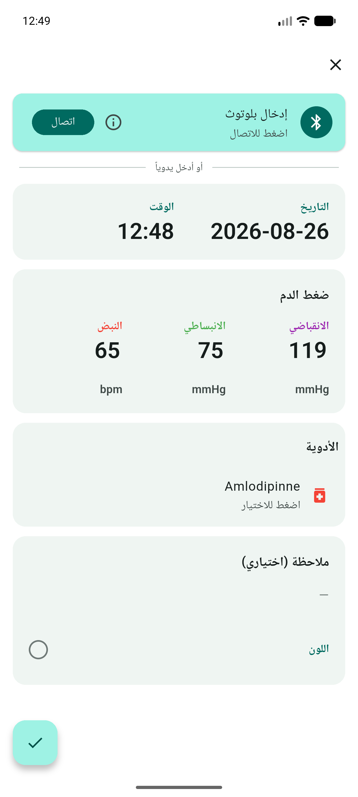
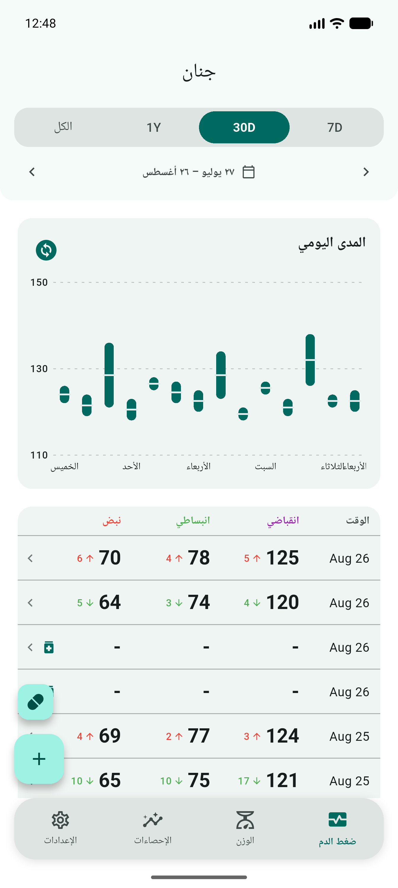
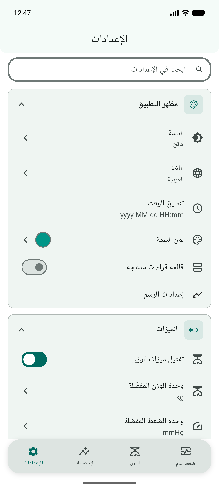
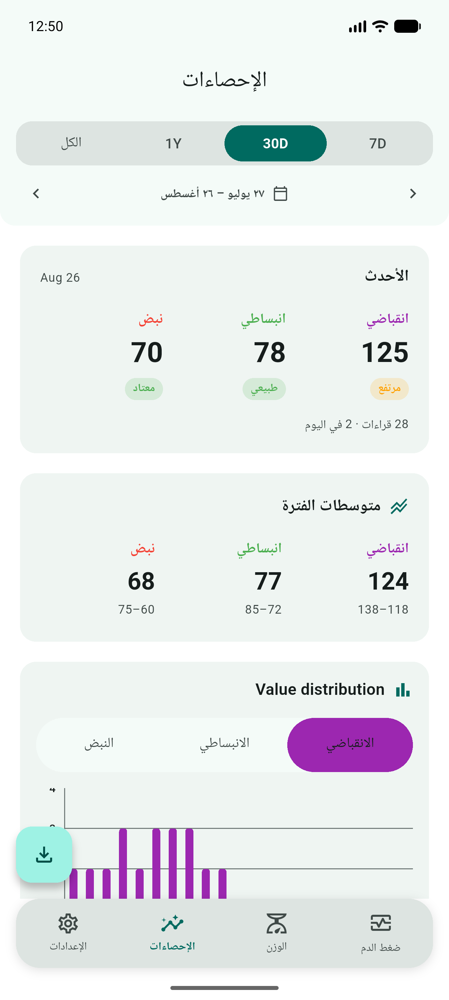
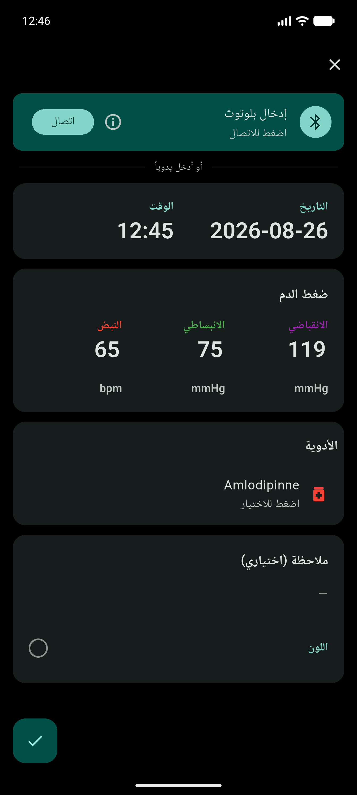
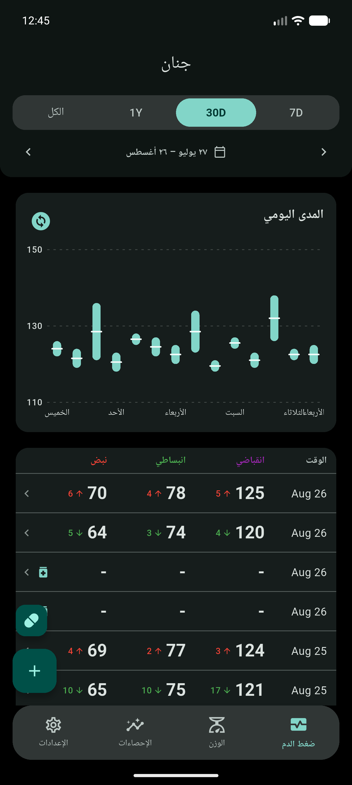
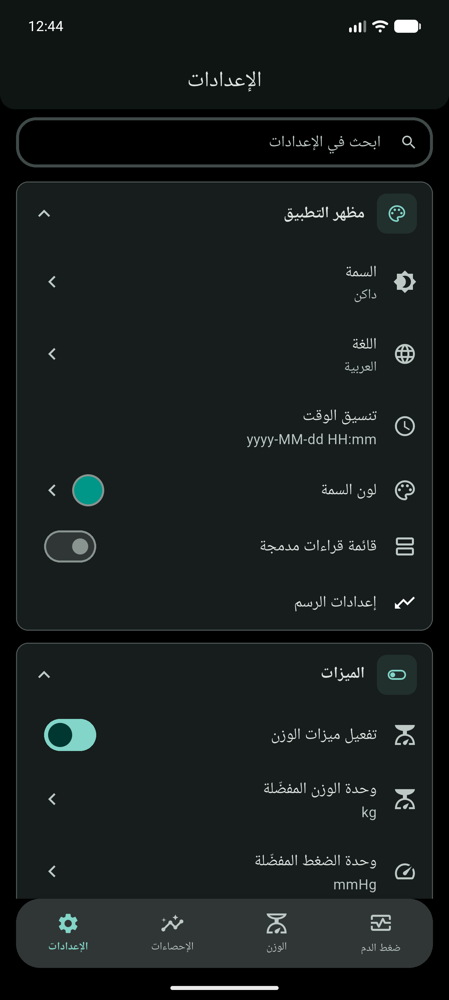
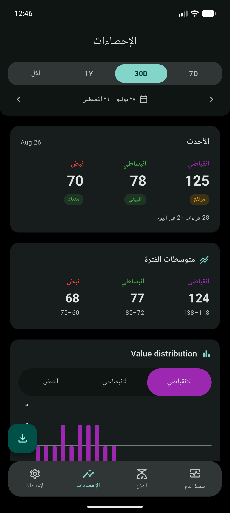

<!-- markdownlint-disable MD033 MD060 -->

<div dir="rtl" lang="ar">

<p align="center">
  
</p>

<h1 align="center">الجَنَان — Janan</h1>

<p align="center">
  <strong>سجّل ضغط الدم. ابقَ البيانات على الجهاز.</strong><br/>
  قراءات، اتجاهات، تصدير للطبيب، وقياس من جهاز بلوتوث.<br/>
  <span dir="ltr">Flutter</span> · يعمل أوفلاين · بلا حساب.
</p>

<p align="center">
  <a href="https://github.com/Zyzto/blood-pressure-monitor-fl/releases/latest"></a>
  <a href="https://github.com/Zyzto/blood-pressure-monitor-fl"></a>
  <a href="https://apps.obtainium.imranr.dev/redirect.html?r=obtainium://add/https://github.com/Zyzto/blood-pressure-monitor-fl/releases"></a>
  
  <a href="LICENSE.md"></a>
</p>

<p align="center">
  <a href="https://github.com/Zyzto/blood-pressure-monitor-fl/releases/latest"><strong>آخر إصدار</strong></a>
  ·
  <a href="#هذه-نسخة-مفرّعة">هذه نسخة مفرّعة</a>
  ·
  <a href="#ما-الذي-يختلف-عن-الأصل">ما الذي يختلف</a>
  ·
  <a href="#ماذا-تقدّم">ماذا تقدّم؟</a>
  ·
  <a href="#لقطات">لقطات</a>
  ·
  <a href="#التثبيت">التثبيت</a>
  ·
  <a href="#التطوير">التطوير</a>
  <br/>
  <a href="README.md"><span dir="ltr">English</span></a>
</p>

<p align="center">
  الاسم من العربية: <strong>الجَنَان</strong>
  (<span dir="ltr"><em>al-janān</em></span>) — القلب.<br/>
  والاسم اللاتيني <span dir="ltr"><strong>Janan</strong></span> مأخوذ منه.
</p>

---

## هذه نسخة مفرّعة

الجَنَان نسخة مفرّعة من
[blood-pressure-monitor-fl](https://github.com/derdilla/blood-pressure-monitor-fl)
لـ [derdilla](https://github.com/derdilla).

هذا المستودع هو
[Zyzto/blood-pressure-monitor-fl](https://github.com/Zyzto/blood-pressure-monitor-fl).
المسائل والطلبات والإصدارات تُفتح هنا. لا نرسل العمل من هذا الفرع إلى المشروع الأصلي.

التطبيق الأصلي ما زال ينشره صاحبه على
[Google Play](https://play.google.com/store/apps/details?id=com.derdilla.bloodPressureApp)
باسم *Blood pressure monitor*
(<span dir="ltr"><code>com.derdilla.bloodPressureApp</code></span>).
ذلك المتجر للمشروع الأصلي، وليس لهذا الفرع.
الجَنَان يستخدم <span dir="ltr"><code>com.shenepoy.janan</code></span>
ويتثبّت إلى جانب النسخة الأصلية.

---

## ما الذي يختلف عن الأصل

مقارنةً بـ
[derdilla/blood-pressure-monitor-fl](https://github.com/derdilla/blood-pressure-monitor-fl)
على <span dir="ltr"><code>main</code></span> (الإصدار <span dir="ltr">v1.8.15</span>).
هذا الفرع ليس تحديثاً لتثبيت بلاي أو إف-درويد.

| | الأصل | هذا الفرع |
|---|---|---|
| **الاسم** | Blood pressure monitor | الجَنَان · Janan |
| **معرّف أندرويد** | <span dir="ltr"><code>com.derdilla.bloodPressureApp</code></span> | <span dir="ltr"><code>com.shenepoy.janan</code></span> |
| **التثبيت** | بلاي، إف-درويد، GitHub | إصدارات GitHub و[Obtainium](https://github.com/ImranR98/Obtainium) |
| **الإصدار** | Semver <span dir="ltr"><code>1.8.15+57</code></span> | CalVer <span dir="ltr"><code>YY.0M.MICRO</code></span> (الآن <span dir="ltr"><code>26.08.0+58</code></span>) |
| **البنية** | مجلد <span dir="ltr"><code>app/</code></span> وحزم مساحة عمل | تطبيق Flutter واحد في جذر المستودع |

**ما أُضيف هنا**

| | |
|---|---|
| **ملفات BLE** | توجيه لكل جهاز: GATT القياسي، ويونكر، ومايكرولايف. |
| **أجهزة محفوظة** | حفظ الجهاز بمعرّف واسم (الإعدادات ← أجهزة البلوتوث). |
| **مزامنة عند الفتح** | سحب من جهاز محفوظ عند التشغيل؛ الحالة في شريط التطبيق. |
| **Eufy P1** | وزن ومعاوقة اختيارية. تركيب الجسم إن وُجد ملف شخصي. P2 غير مدعوم. |
| **التفاصيل** | شاشة لكل سجل ضغط أو وزن (والتركيب إن وُجدت أوم وملف شخصي). |
| **الرئيسية** | جولة أول تشغيل، لوحة لآخر قراءة، وشريط تنقّل (الرئيسية / الوزن / الإحصاءات / الإعدادات). |

**اختلافات داخلية**

- التخزين المحلي PowerSync في <span dir="ltr"><code>health.db</code></span> (جداول محلية فقط). يُنسخ <span dir="ltr"><code>bp.db</code></span> القديم عند الإطلاق إن وُجد.
- الحالة Riverpod مولَّد. النصوص <span dir="ltr"><code>easy_localization</code></span> في <span dir="ltr"><code>assets/translations/</code></span>، لا ملفات ARB المولَّدة.
- حزم الأصل <span dir="ltr"><code>health_data_store</code></span> و<span dir="ltr"><code>settings_annotation</code></span> و<span dir="ltr"><code>settings_builder</code></span> ليست في هذا الفرع.

ما بقي من الأصل هنا أيضاً: الإدخال اليدوي، الرسوم، التصدير (CSV / PDF / SQLite)، Health Connect، و[الأجهزة المجرّبة](docs/bluetooth.md).

---

## ماذا تقدّم؟

| | |
|---|---|
| **ضغط الدم** | الانقباضي، الانبساطي، النبض، ملاحظات، وجرعات الدواء. |
| **الوزن** | سجل اختياري، مؤشر كتلة الجسم، وتركيب الجسم من ميزان متوافق. |
| **الرسوم** | اتجاهات، توزيع، ووقت اليوم. |
| **بلوتوث** | سحب من [جهاز قياس أو ميزان](docs/bluetooth.md). |
| **التصدير** | <span dir="ltr">CSV</span> و<span dir="ltr">PDF</span> وExcel أو نسخة من قاعدة البيانات. |
| **Health Connect** | مزامنة اختيارية على أندرويد. |
| **أوفلاين** | على الجهاز. بلا حساب. |

---

## لقطات

<div dir="ltr">
<p align="center">
  
  
  
  
</p>
</div>

<details>
<summary>السمة الداكنة</summary>
<div dir="ltr">
<p align="center">
  
  
  
  
</p>
</div>
</details>

---

## التثبيت

### أندرويد

| الخيار | |
|--------|--|
| **Obtainium** (مستحسن) | [](https://apps.obtainium.imranr.dev/redirect.html?r=obtainium://add/https://github.com/Zyzto/blood-pressure-monitor-fl/releases) — يتابع [إصدارات GitHub](https://github.com/Zyzto/blood-pressure-monitor-fl/releases) |
| **APK** | من [آخر إصدار](https://github.com/Zyzto/blood-pressure-monitor-fl/releases/latest) |

هذا الفرع ليس على بلاي. ابنِ من المصدر إن أردت نسخة توقّعها أنت.

---

## التطوير

**المتطلبات:** Flutter <span dir="ltr"><code>3.47.1</code></span> (مثبّت في <span dir="ltr"><code>pubspec.yaml</code></span>).

```bash
git clone https://github.com/Zyzto/blood-pressure-monitor-fl.git
cd blood-pressure-monitor-fl
dart run build_runner build
flutter run
```

```bash
flutter build apk
```

بناء أندرويد للإصدار يحتاج [مفتاح توقيع](https://docs.flutter.dev/deployment/android#sign-the-app).

---

## المعمارية (باختصار)

- **الواجهة / الحالة** — Flutter وRiverpod المولَّد
- **قاعدة البيانات** — جداول PowerSync محلية فقط (<span dir="ltr"><code>health.db</code></span>)
- **الإدخال** — نماذج يدوية، بلوتوث LE لخدمة ضغط الدم، وHealth Connect اختياري
- **التصدير** — CSV وPDF وSQLite

التفاصيل في [`docs/`](docs/).

---

## الوثائق

| الدليل | |
|-------|--|
| [أجهزة البلوتوث](docs/bluetooth.md) | أجهزة الضغط والموازين وكيف تُرسل القراءات |
| [حزمة البيانات](docs/data-package.md) | شكل السجلات المخزّنة |
| [أسلوب الشفرة](docs/codestyle.md) | اصطلاحات هذا الفرع |
| [الاختبارات](docs/testing.md) | تنظيم الاختبارات |
| [المساهمة](CONTRIBUTING.md) | العلل والترجمة والطلبات على **هذا** المستودع |

---

## المساهمة

افتح المسائل والطلبات على
[Zyzto/blood-pressure-monitor-fl](https://github.com/Zyzto/blood-pressure-monitor-fl).
انظر [CONTRIBUTING.md](CONTRIBUTING.md).

لا ترسل ترقيعات إلى مستودع derdilla الأصلي من هذا الفرع.

---

## الرخصة

[GPL-3.0](LICENSE.md)، كما في المشروع الأصلي.

الاسم **الجَنَان** والاسم اللاتيني <span dir="ltr"><strong>Janan</strong></span>
والشعار ليست إذناً بإعادة استخدام الهوية. فرّع الشفرة إن شئت، وانشر فرعك باسم وأيقونة غير هذه.

---

<p align="center">
  من <a href="https://shenepoy.com"><strong>shenepoy</strong></a>
  ·
  <a href="https://github.com/Zyzto">GitHub</a>
  ·
  فرع من <a href="https://github.com/derdilla/blood-pressure-monitor-fl">derdilla/blood-pressure-monitor-fl</a>
</p>

</div>
