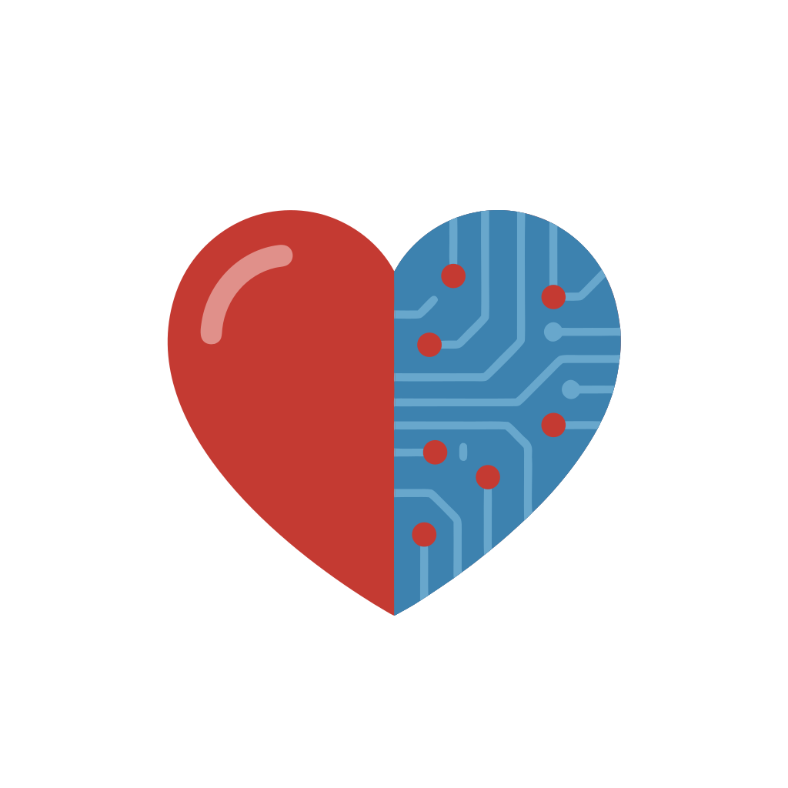
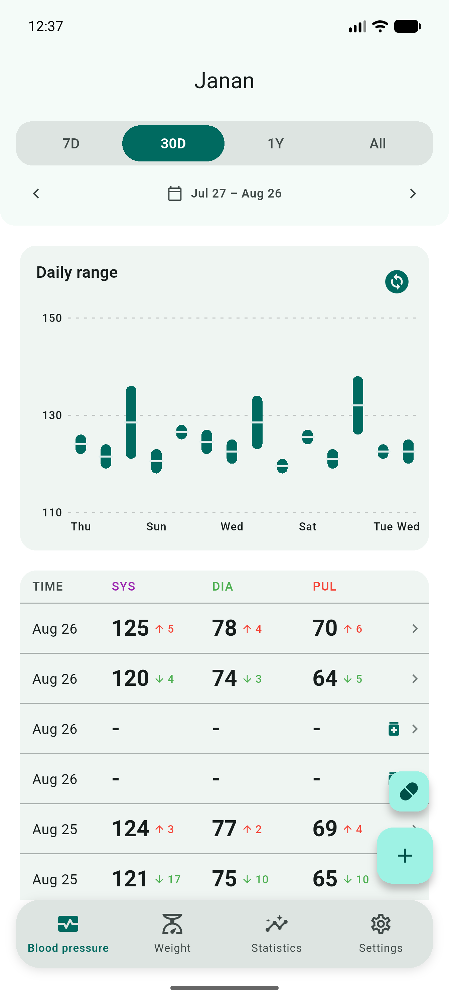
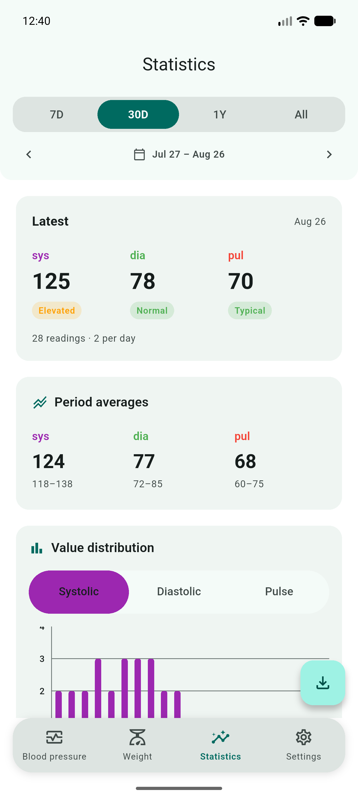
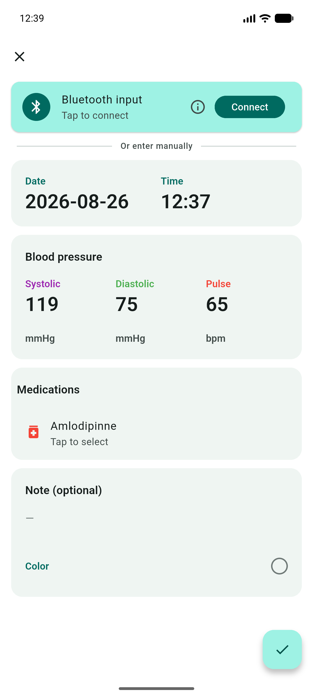
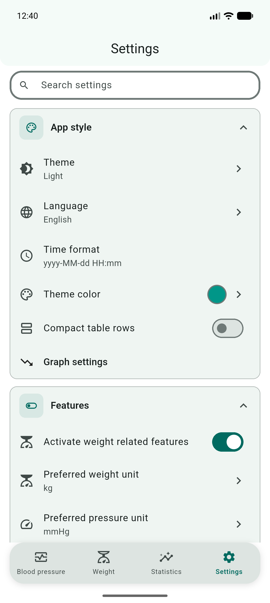
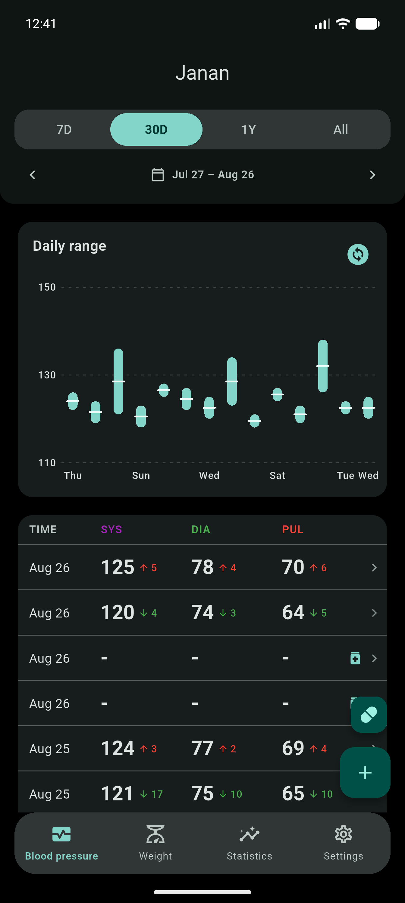
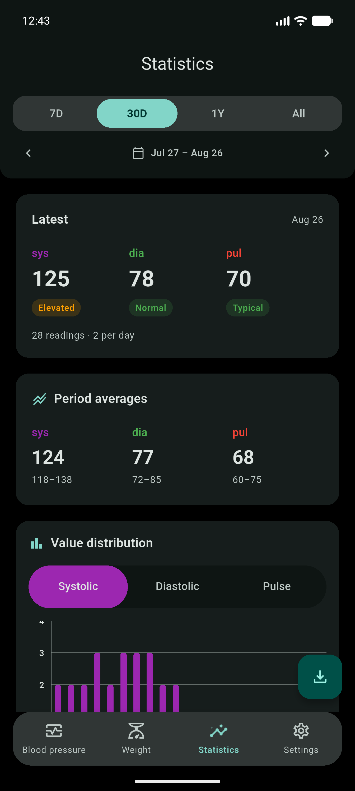
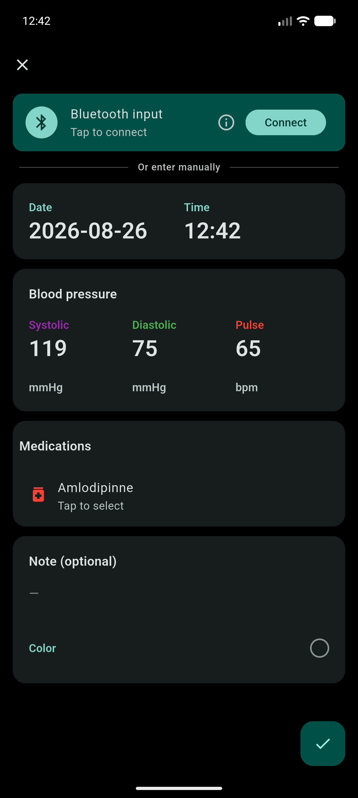
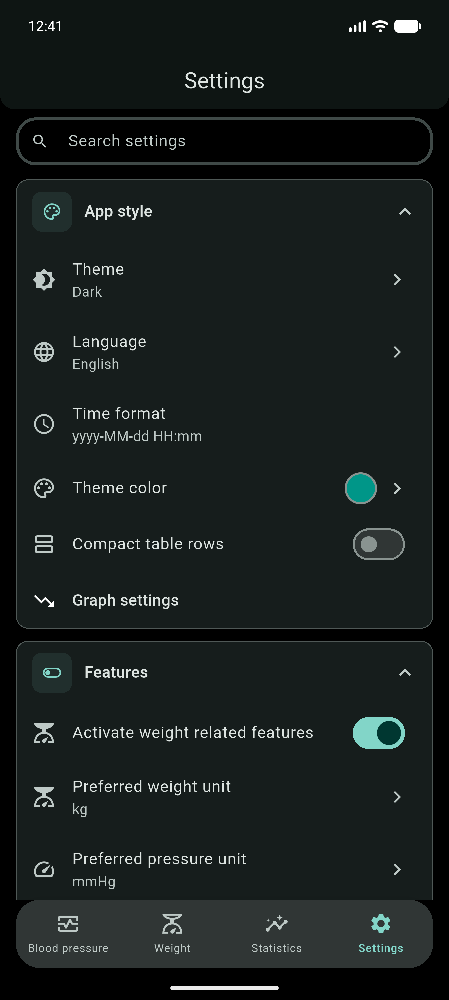

<!-- markdownlint-disable MD033 MD060 -->

<p align="center">
  
</p>

<h1 align="center">Janan - الجَنَان</h1>

<p align="center">
  <strong>Track blood pressure. Keep it on the device.</strong><br/>
  Log readings, see trends, export for a doctor, and pull measurements from a
  Bluetooth meter. Flutter · offline-first · no account.
</p>

<p align="center">
  <a href="https://github.com/Zyzto/blood-pressure-monitor-fl/releases/latest"></a>
  <a href="https://github.com/Zyzto/blood-pressure-monitor-fl/actions/workflows/ci.yml"></a>
  <a href="https://github.com/Zyzto/blood-pressure-monitor-fl"></a>
  <a href="https://apps.obtainium.imranr.dev/redirect.html?r=obtainium://add/https://github.com/Zyzto/blood-pressure-monitor-fl/releases"></a>
  
  <a href="LICENSE.md"></a>
</p>

<p align="center">
  <a href="https://github.com/Zyzto/blood-pressure-monitor-fl/releases/latest"><strong>Latest release</strong></a>
  ·
  <a href="#this-is-a-fork">This is a fork</a>
  ·
  <a href="#whats-different-from-upstream">What's different</a>
  ·
  <a href="#what-you-get">What you get</a>
  ·
  <a href="#screenshots">Screenshots</a>
  ·
  <a href="#install">Install</a>
  ·
  <a href="#develop">Develop</a>
  ·
  <a href="README.ar.md">العربية</a>
</p>

<p align="center">
  The name <strong>Janan</strong> comes from Arabic
  <span dir="rtl"><strong>الجَنَان</strong></span>
  (<em>al-janān</em>): the heart.
</p>

---

## This is a fork

Janan is a fork of [blood-pressure-monitor-fl](https://github.com/derdilla/blood-pressure-monitor-fl) by [derdilla](https://github.com/derdilla).

This repository is [Zyzto/blood-pressure-monitor-fl](https://github.com/Zyzto/blood-pressure-monitor-fl). Issues, pull requests, and releases belong here. Work from this tree is not sent upstream.

The original app is still published by its author on [Google Play](https://play.google.com/store/apps/details?id=com.derdilla.bloodPressureApp) as *Blood pressure monitor* (`com.derdilla.bloodPressureApp`). That listing is upstream, not this fork. Janan uses `com.shenepoy.janan` and installs next to the original.

---

## What's different from upstream

Compared to [derdilla/blood-pressure-monitor-fl](https://github.com/derdilla/blood-pressure-monitor-fl) `main` (v1.8.15). This tree is not a drop-in update of a Play or F-Droid install.

| | Upstream | This fork |
|---|---|---|
| **Name** | Blood pressure monitor | Janan · الجَنَان |
| **Android id** | `com.derdilla.bloodPressureApp` | `com.shenepoy.janan` |
| **Install** | Play, F-Droid, GitHub | GitHub Releases + [Obtainium](https://github.com/ImranR98/Obtainium) |
| **Version** | Semver `1.8.15+57` | CalVer `YY.0M.MICRO` (now `26.09.2+66`) |
| **Layout** | `app/` plus workspace packages | One Flutter app at the repo root |

**Added here**

| | |
|---|---|
| **BLE profiles** | Per-device routes for standard GATT, Yonker, and Microlife meters. |
| **Saved meters** | Remember a device as an id and a name (Settings → Bluetooth devices). |
| **Launch sync** | Pull from a saved meter on open; status in the AppBar. |
| **Eufy P1** | Weight plus optional impedance. Body composition when a body profile is set. P2 is unsupported. |
| **Details** | A screen per blood-pressure or weight record (composition when ohms and a profile are present). |
| **Home** | First-run onboarding, a latest-reading dashboard, and a bottom-nav shell (home / weight / stats / settings). |

**Internals that differ**

- Local store is PowerSync `health.db` (local-only tables). A leftover upstream `bp.db` is copied in on launch.
- State is generated Riverpod. Strings are `easy_localization` JSON under `assets/translations/`, not generated ARB.
- Upstream packages `health_data_store`, `settings_annotation`, and `settings_builder` are gone from this tree.

What upstream already has and this fork still has: manual input, graphs, CSV / PDF / SQLite export, Health Connect, and the [tested devices](docs/bluetooth.md) list.

---

## What you get

| | |
|---|---|
| **Blood pressure** | Systolic, diastolic, pulse, notes, and medicine doses. |
| **Weight** | Optional log, BMI, and body composition from a compatible scale. |
| **Charts** | Trends, distribution, and time of day. |
| **Bluetooth** | Pull from a [meter or scale](docs/bluetooth.md). |
| **Export** | CSV, PDF, Excel, or a database backup. |
| **Health Connect** | Optional Android sync. |
| **Offline** | On the device. No account. |

---

## Screenshots

<div dir="ltr">
<p align="center">

  
  
  
  
  
</p>
</div>

<details>
<summary>Dark theme</summary>
<p align="center">
 
  
  
  
  

</p>
</details>
---

## Install

### Android

| Option | |
|--------|--|
| **Obtainium** (recommended) | [](https://apps.obtainium.imranr.dev/redirect.html?r=obtainium://add/https://github.com/Zyzto/blood-pressure-monitor-fl/releases) — tracks [GitHub Releases](https://github.com/Zyzto/blood-pressure-monitor-fl/releases) |
| **APK** | From the [latest release](https://github.com/Zyzto/blood-pressure-monitor-fl/releases/latest) |

This fork is not on Play. Build from source if you want a copy you signed yourself.

---

## Develop

**Requirements:** Flutter `3.47.1` (pinned in `pubspec.yaml`).

```bash
git clone https://github.com/Zyzto/blood-pressure-monitor-fl.git
cd blood-pressure-monitor-fl
dart run build_runner build
flutter run
```

```bash
flutter build apk
```

Release Android builds need a [signing key](https://docs.flutter.dev/deployment/android#sign-the-app). CI and Obtainium releases are in [docs/ci.md](docs/ci.md).

---

## Architecture (short)

- **UI / state** — Flutter, generated Riverpod
- **Local DB** — PowerSync local-only tables (`health.db`)
- **Input** — Manual forms, Bluetooth LE blood-pressure service, optional Health Connect
- **Export** — CSV, PDF, SQLite

Deeper notes live in [`docs/`](docs/).

---

## Docs

| Guide | |
|-------|--|
| [Bluetooth devices](docs/bluetooth.md) | Meters, scales, and how they report readings |
| [Data package](docs/data-package.md) | How stored records are shaped |
| [Code style](docs/codestyle.md) | Conventions in this tree |
| [Testing](docs/testing.md) | How tests are organized |
| [CI and releases](docs/ci.md) | Analyze, test, signed APK, Obtainium |
| [Contributing](CONTRIBUTING.md) | Bugs, translations, PRs on **this** repo |

---

Open issues and pull requests on [Zyzto/blood-pressure-monitor-fl](https://github.com/Zyzto/blood-pressure-monitor-fl). See [CONTRIBUTING.md](CONTRIBUTING.md).

Do not send patches to the upstream derdilla repository from this fork.

---

## License

[GPL-3.0](LICENSE.md), same as the upstream project.

The name **Janan**, the Arabic wordmark <span dir="rtl">**الجَنَان**</span>, and the logo are not a grant to reuse the branding. Fork the code if you want, and ship your fork under a different name and icon.

---

<p align="center">
  Made by <a href="https://shenepoy.com"><strong>shenepoy</strong></a>
  ·
  <a href="https://github.com/Zyzto">GitHub</a>
  ·
  fork of <a href="https://github.com/derdilla/blood-pressure-monitor-fl">derdilla/blood-pressure-monitor-fl</a>
</p>
