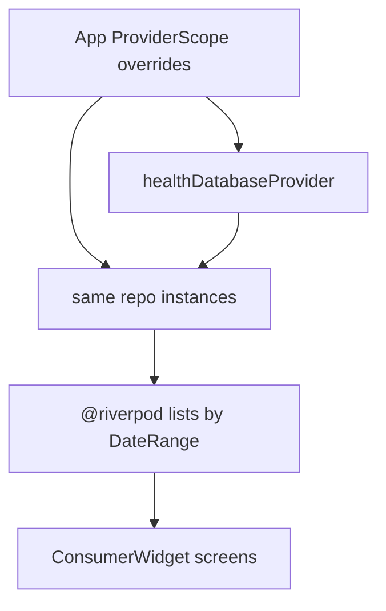

*developer documentation - users can safely ignore this*

User measurements live in `{databases}/health.db`, a PowerSync database that uses only `Table.localOnly` tables. The app never calls `connect()` and never wipes the file on schema mismatch.

Domain types and repository interfaces live in `lib/domain/`. Implementations in `lib/core/repository/` talk to PowerSync through `execute` / `getAll` / `watch`. UI reads them through generated Riverpod providers.

`App` overrides the repository providers with the objects it already created. `subscribe()` is a per-instance broadcast stream, so Health Connect listeners and `MedCache` only hear writes if they share those instances.

## Schema

PowerSync adds a text `id` on every table. Do not declare `id`.

- `blood_pressure`: `timestamp_unix_s`, `sys_kpa`, `dia_kpa`, `pul`
- `notes`: `timestamp_unix_s`, `note`, `color`
- `weights`: `timestamp_unix_s`, `weight_kg`, `impedance_ohm`
- `medicines`: `designation`, `color`, `default_dose_mg`, `removed`
- `intakes`: `timestamp_unix_s`, `med_id`, `dosis_mg`

SI storage: pressure kPa, weight kg, medicine dose mg, timestamps in seconds.

`add` at an existing timestamp upserts that type. Same-second blood pressure, note, and intake still join as `CombinedEntry`.

Later columns: update the `Table.localOnly` definition. No wipe-and-recreate.

## Migration

As long as `{databases}/bp.db` still exists and looks like the old timestamp-hub schema, every launch upserts it into `health.db` through `LegacyBpDb`. That retries a partial copy (notes, weights, intakes, medicines) instead of skipping once any blood-pressure row is present.

Medicines copy their `removed` flag. Re-import uses `upsert` so the same designation+color+dose does not create a second row. Intakes of soft-deleted medicines still resolve.

After every table's row count meets or exceeds the legacy file, `bp.db` is renamed to `bp.legacy.db`. A mismatch leaves `bp.db` in place for the next launch. Counts use `SELECT COUNT(*)`. `DateRange.all()` is epoch through year 9999 so future-dated rows still appear in lists and delete-all.

Delete-data uses repositories / `DELETE FROM` local-only tables, not a file wipe of the live database.

## Import and export

`.db` export runs `PRAGMA wal_checkpoint(FULL)` on the open `health.db` first so the copied bytes include the WAL, then reads `{databases}/health.db`.

`.db` import opens the picked file read-only with sqflite and sniffs tables: `Timestamps` is legacy `bp.db`; a `blood_pressure` table or view is the live schema. Anything else returns 0 imported rows and is never opened with PowerSync, so a random file does not get schema written onto it.
